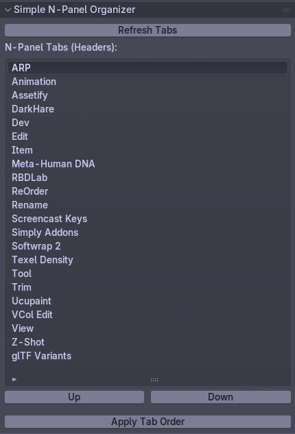

# Simple N-Panel Organizer

A Blender addon to organize, reorder, and resize your N-Panel tabs easily. Tab order is persistent and automatically saved when you apply changes.

## Features
- Drag and reorder N-Panel tab headers
- Move tabs up/down with buttons
- Apply tab order (automatically saves)
- Tab order persists across Blender sessions and workspace switches
- Resizable tab list UI

## Installation
1. Download reorder_npanel_tabs.py
2. Place in your Blender addons directory or install via Blender's Add-ons panel
3. Enable "Simple N-Panel Organizer" in Blender

## Usage
- Go to the Sidebar (N-Panel) in the 3D View
- Use the organizer panel to reorder tabs and apply changes
- No need to manually save—order is saved automatically

## Author
OPQA Videogames

## License
MIT

